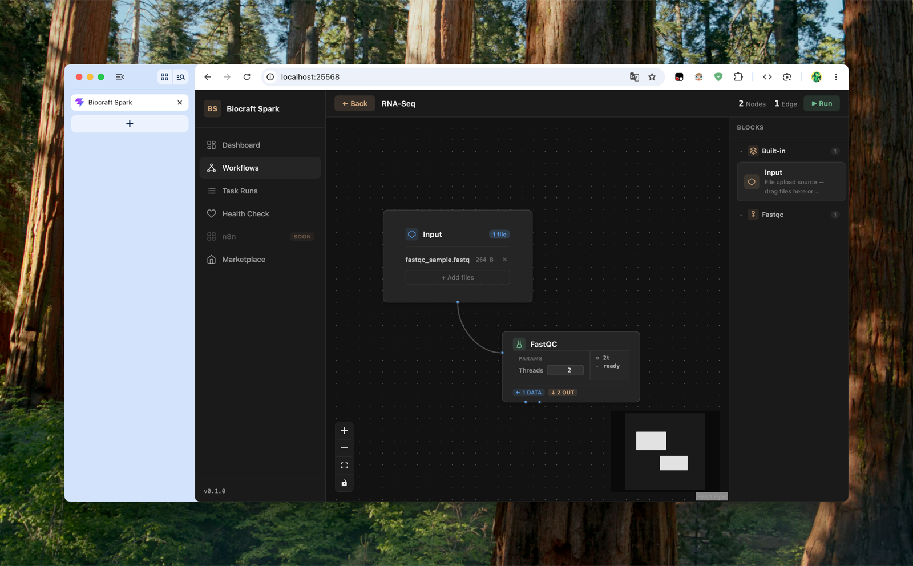

# Biocraft-Spark

<p align="center">
  
</p>

> A local, cross-platform bioinformatics workbench for everyone — no Linux expertise required.

Biocraft-Spark lowers the barrier to bioinformatics by wrapping professional-grade tools inside a local web GUI backed by container isolation. Users define analysis pipelines as visual workflows; the runtime schedules and executes them in Docker/Podman containers, keeping data local and environments reproducible.



---

## Table of Contents

- [Get Started](#get-started)
- [Overview](#overview)
- [Architecture](#architecture)
- [Tech Stack](#tech-stack)
- [Prerequisites](#prerequisites)
- [Project Structure](#project-structure)
- [Plugin Format](#plugin-format)
- [Marketplace](#marketplace)
- [Debug Endpoints](#debug-endpoints)
- [API Endpoints](#api-endpoints)
- [Documentation](#documentation)

---

## Get Started

New here? You don't need to be a developer — no git, Python, or command-line
experience required. The installer sets up the container runtime for you. Pick
your platform and run **one command**.

### macOS

1. Open **Terminal** (press <kbd>Cmd</kbd>+<kbd>Space</kbd>, type `Terminal`).
2. Paste this and press Enter:

   ```bash
   curl -fsSL https://raw.githubusercontent.com/frostlinelab/biocraft-spark/main/install.sh | bash
   ```

3. The installer sets up **OrbStack** if you don't already have a container
   runtime. When the OrbStack window appears, **approve the permission
   prompts**. On a slower Mac the first launch can take a few minutes — the
   installer keeps checking and prints progress until OrbStack is ready.
4. When you see the green **"Biocraft-Spark is running!"** message, open
   **http://127.0.0.1:25568** in your browser.

### Linux

1. Open a terminal.
2. Paste this and press Enter:

   ```bash
   curl -fsSL https://raw.githubusercontent.com/frostlinelab/biocraft-spark/main/install.sh | bash
   ```

3. No Docker installed? The installer installs Docker Engine for you. It uses
   `sudo` for Docker during this session — to drop sudo later, log out and back
   in (or run `newgrp docker`).
4. Open **http://127.0.0.1:25568**, or the **LAN URL** the installer prints
   (e.g. `http://192.168.x.x:25568`) to reach Biocraft-Spark from another
   machine on the same network.

### Your first analysis

1. The **Dashboard** opens by default — it's empty until you run a workflow.
2. Open **Marketplace** in the sidebar and click **Install** on **FastQC**
   (quality control for sequencing reads).
3. Open the **Workflow** editor and drag these blocks onto the canvas, then
   connect them in order:

   ```
   Start ──▶ Input ──▶ FastQC ──▶ End
   ```

4. Click the **Input** block and upload a `.fastq` (or `.fastq.gz`) file.
5. Click **Run**. Watch the per-step progress; when it finishes, open the run
   to download the **FastQC HTML report** and data zip (collected at the End
   block).

### Stop, restart, or update

```bash
cd ~/.biocraft-spark
./install.sh stop        # stop the server
./install.sh restart     # restart it
./install.sh logs        # view logs (Ctrl+C to exit)
```

To **update** later, just re-run the one-line install command — it pulls the
latest image.

Hit a snag? See the [troubleshooting guide](docs/troubleshooting.md).

---

## Overview

Biocraft-Spark is built around three ideas:

1. **Local-first** — all computation runs on your machine; no data leaves your environment.
2. **Container-isolated** — every tool runs inside a Docker/Podman container, eliminating dependency conflicts.
3. **Visual workflow editor** — pipelines are built with a drag-and-drop node editor backed by React Flow, making it easy to compose and reconfigure analysis steps without writing code.

The web frontend (React + Vite) talks to the Django backend over HTTP. In production Django serves the built SPA bundle directly, so API calls and page loads share the same origin.

---

## Architecture

```
┌─────────────────────────────────────────────┐
│          Web Frontend (React + Vite)        │
│          Served by Django · same-origin API │
└──────────────────┬──────────────────────────┘
                   │
┌──────────────────▼──────────────────────────┐
│          Django App Layer                   │
│          REST API · Workbench views         │
└──────────────────┬──────────────────────────┘
                   │
┌──────────────────▼──────────────────────────┐
│          Core Runtime (biocraft_core/)      │
│  ┌─────────────┐  ┌──────────────────────┐  │
│  │ DAG         │  │ Container Executor   │  │
│  │ Scheduler   │→ │ (Docker out-of-      │  │
│  │             │  │  Docker via socket)  │  │
│  └─────────────┘  └──────────────────────┘  │
│  ┌──────────────────────────────────────┐   │
│  │ Plugin Loader  (YAML + JSON Schema)  │   │
│  └──────────────────────────────────────┘   │
└──────────────────┬──────────────────────────┘
                   │
┌──────────────────▼──────────────────────────┐
│          Data Layer  (SQLite · volumes)     │
└─────────────────────────────────────────────┘
```

The backend container mounts the host Docker socket (`/var/run/docker.sock`) so it can spin up sibling containers — Docker-out-of-Docker without privilege escalation.

---

## Tech Stack

| Layer | Technology |
|---|---|
| Web frontend | React 19 · TypeScript 6 · Vite 8 |
| Workflow editor | @xyflow/react (React Flow) 12.x — drag-and-drop node editor |
| Backend framework | Django 6.0.4 · Python |
| Container runtime | Docker ≥ 7.0 (docker-py SDK) |
| DAG scheduling | Custom (`biocraft_core/runtime/scheduler/`) |
| Plugin format | YAML + JSON Schema (jsonschema ≥ 4.0) |
| Database | SQLite 3 |
| Orchestration | Docker Compose |

---

## Prerequisites

- **A container runtime** — the installer provisions this automatically:
  - **Linux:** installs Docker Engine via `get.docker.com` if missing
  - **macOS:** installs **OrbStack** if missing (the required runtime on macOS — see [troubleshooting](docs/troubleshooting.md))
- **curl** (preinstalled on macOS and almost every Linux distro)

> No git, Xcode/Command Line Tools, Python, or Node.js required — the installer
> fetches only `docker-compose.standalone.yml` and pulls the pre-built image.
> Python 3.12+ and Node.js 20+ are only needed for development from source.

---

## Project Structure

```
biocraft-spark/
├── biocraft_core/          # Core runtime — no Django dependency
│   ├── runtime/
│   │   ├── executor/       # DockerExecutor, types, errors
│   │   └── scheduler/      # DAG, Engine (topological sort + parallel waves)
│   └── plugin/             # YAML loader, JSON Schema validator
├── biocraft_spark/         # Django project config (settings, urls, wsgi/asgi)
├── workbench/              # Django app — views, models, API, middleware
├── templates/              # Django HTML templates
├── frontend/               # Vite + React web app (built to dist/, served by Django)
│   ├── src/                # React components
│   │   ├── components/     # AppLayout, Sidebar, Dashboard, WorkflowCanvas, ...
│   │   └── lib/            # API client
│   └── dist/               # Built bundle (gitignored, served as /static/)
├── docs/                   # Troubleshooting guide
├── CONTRIBUTING.md         # Plugin development guide
├── docker-compose.yml
├── Dockerfile
├── requirements.txt
└── manage.py
```

---

## Plugin Format

Plugins are YAML files that define one or more **blocks** (draggable workflow nodes). Each block declares its container runtime, typed input/output ports, and configurable parameters. Biocraft automatically discovers plugins in the `plugins/` directory and surfaces them as categorized blocks in the workflow editor.

**Example plugin (FastQC):** installable from the Marketplace — FastQC quality control for sequencing reads.

```yaml
name: fastqc
version: "1.0.0"
description: Quality control for high-throughput sequencing reads
icon: microscope
blocks:
  - name: run-fastqc
    label: FastQC
    runtime:
      image: biocontainers/fastqc:v0.11.9_cv8
      command: ["sh", "-c", "fastqc -q -o /data/output -t ${params.threads} /data/input/*"]
      resources: { min_threads: 1, min_memory_gb: 1.0 }
    inputs:
      - name: reads
        type: file
        pattern: "*.fastq*"
        multiple: true
    outputs:
      - name: report
        type: file
        pattern: "*_fastqc.html"
    params:
      - name: threads
        type: integer
        default: 2
```

> See [CONTRIBUTING.md](CONTRIBUTING.md) for the plugin development guide and [docs/plugin-authoring.md](docs/plugin-authoring.md) for the complete plugin authoring reference.

---

## Marketplace

Biocraft-Spark ships with a built-in **Marketplace** for browsing, installing, and uninstalling community plugins from a remote registry — no manual YAML copying required.

- **Browse** the catalog from the sidebar's Marketplace view: each plugin shows its version, author, description, and a ✨ **Beautiful Creatures** badge when it has been curated.
- **Install** a plugin with one click — the backend downloads the manifest, verifies its SHA-256, validates it against the plugin schema, writes it to `plugins/`, and records it. The new block appears in the workflow editor after a page refresh.
- **Uninstall** marketplace-installed plugins at any time. Biocraft-Spark ships with no built-in bioinformatics tools — every plugin is user-installed and removable.

The registry lives in a separate public repository, [**biocraft-marketplace**](https://github.com/frostlinelab/biocraft-marketplace), statically hosted on Cloudflare Pages. **Curation equals certification**: a plugin enters the registry only after its code has been reviewed, and those promoted to the *Beautiful Creatures* selection are listed in the registry's `beautiful-creatures.txt` allowlist. The catalog is actively growing as new plugins are reviewed and added.

The backend proxies and caches the remote `index.json` (5-minute TTL) and enriches each entry with local install state. Override the registry URL with the `BIOCRAFT_MARKETPLACE_INDEX_URL` environment variable. See [API Endpoints](#api-endpoints) for the marketplace API.

---

## Debug Endpoints

These endpoints are available in development to verify each runtime layer independently:

| Endpoint | What it checks |
|---|---|
| `GET /debug/ping-docker/` | Docker socket connectivity + container list |
| `GET /debug/ping-executor/` | Runs a `python:3.12-slim` container; expects `exit_code: 0` |
| `GET /debug/ping-scheduler/` | Runs a 3-node DAG (A → B, A → C); verifies ordering and parallelism |
| `GET /debug/ping-plugin/` | Loads a sample plugin YAML and validates its schema |

---

## API Endpoints

REST API for the workflow frontend:

| Method | Endpoint | Description |
|---|---|---|
| `GET` | `/api/dashboard-stats/` | Aggregate stats (pipeline count, run count, status breakdown) |
| `GET` | `/api/pipelines/` | List all pipelines |
| `POST` | `/api/pipelines/create/` | Create a new pipeline |
| `GET` | `/api/pipelines/<id>/` | Get a single pipeline |
| `PUT` | `/api/pipelines/<id>/` | Update a pipeline (name, description, graph) |
| `DELETE` | `/api/pipelines/<id>/` | Delete a pipeline |
| `POST` | `/api/pipelines/<id>/run/` | Execute a pipeline (creates a TaskRun) |
| `GET` | `/api/task-runs/` | List task runs (optional `?pipeline_id=` filter) |
| `GET` | `/api/task-runs/<id>/` | Get a single task run with results |
| `GET` | `/api/marketplace/catalog/` | Fetch the enriched plugin catalog (remote index + local install state) |
| `POST` | `/api/marketplace/install/` | Install a plugin from a `yaml_url` (downloads, verifies, validates, persists) |
| `DELETE` | `/api/marketplace/plugins/<name>/` | Uninstall a marketplace-installed plugin |

---

## Documentation

| Document | Description |
|---|---|
| [CONTRIBUTING.md](CONTRIBUTING.md) | Plugin development guide — YAML format, IO routing, container specs |
| [docs/plugin-authoring.md](docs/plugin-authoring.md) | Complete plugin authoring reference — block definition, port types, params, resources, examples |
| [docs/built-in-blocks.md](docs/built-in-blocks.md) | Built-in block reference — Start, End, Input |
| [docs/runtime-config.md](docs/runtime-config.md) | CPU/memory resource pool configuration |
| [docs/troubleshooting.md](docs/troubleshooting.md) | Common issues — Docker, timeouts, schema validation, scheduler |

## Contributing

This project is developed by **Frostline Lab**. To run from source, clone the repo and run `./install.sh --help` (lists `--build`, `--dev`, and management commands); for frontend hot-reload see [frontend/README.md](frontend/README.md). For the plugin development guide, see [CONTRIBUTING.md](CONTRIBUTING.md).

---

## License

MIT License

Copyright (c) 2026 Frostline Lab

Permission is hereby granted, free of charge, to any person obtaining a copy
of this software and associated documentation files (the "Software"), to deal
in the Software without restriction, including without limitation the rights
to use, copy, modify, merge, publish, distribute, sublicense, and/or sell
copies of the Software, and to permit persons to whom the Software is
furnished to do so, subject to the following conditions:

The above copyright notice and this permission notice shall be included in all
copies or substantial portions of the Software.

THE SOFTWARE IS PROVIDED "AS IS", WITHOUT WARRANTY OF ANY KIND, EXPRESS OR
IMPLIED, INCLUDING BUT NOT LIMITED TO THE WARRANTIES OF MERCHANTABILITY,
FITNESS FOR A PARTICULAR PURPOSE AND NONINFRINGEMENT. IN NO EVENT SHALL THE
AUTHORS OR COPYRIGHT HOLDERS BE LIABLE FOR ANY CLAIM, DAMAGES OR OTHER
LIABILITY, WHETHER IN AN ACTION OF CONTRACT, TORT OR OTHERWISE, ARISING FROM,
OUT OF OR IN CONNECTION WITH THE SOFTWARE OR THE USE OR OTHER DEALINGS IN THE
SOFTWARE.
